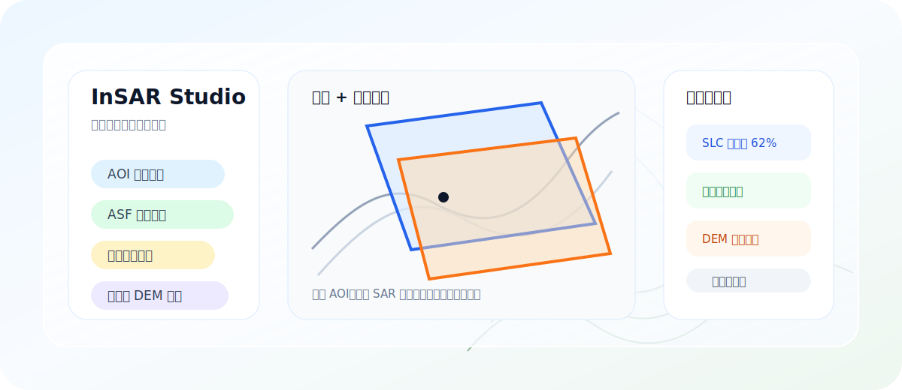

# InSAR Studio


InSAR Studio 是一个面向 InSAR 与遥感数据准备流程的桌面助手。它把 Sentinel-1 / ASF 检索下载、AOI 选择、精密轨道匹配、DEM 准备、目录组织和下载任务管理放在一个更清楚的界面里，帮助新手把“处理前的数据准备”做稳。

本项目不替代 SARscape、ISCE、MintPy、SNAP 或 ASF Vertex。它的定位是：**处理前的数据准备助手**。

<p align="center">
  
</p>

## 适合谁

- 正在学习 SARscape / InSAR 处理流程，希望先把数据准备环节理顺的用户。
- 需要批量检索、筛选、下载 Sentinel-1 SLC/GRD 数据的遥感用户。
- 需要把 SAR 影像、精密轨道、DEM 和辅助数据按统一目录组织的项目。
- 希望后续扩展 Sentinel-2、Landsat、HLS 等免费遥感数据源的桌面工具场景。

不适合：直接替代专业 InSAR 解算软件、绕过数据源账号权限、或承诺一键完成完整形变反演。

## 核心能力

| 模块 | 解决的问题 |
| --- | --- |
| Sentinel-1 / ASF | 检索 SLC/GRD，按 AOI、日期、轨道、极化等条件筛选，并在地图上查看影像范围。 |
| 下载中心 | 管理并发下载、暂停、继续、结束、失败重试、断点续传和详细日志。 |
| SAR 工作台 | 对检索或导入的影像进行搜索、勾选、全选当前列表、单景高亮和单景操作。 |
| AOI 区域 | 支持地图绘制、行政区边界、本地边界文件导入、多要素选择和绑定。 |
| 精密轨道 | 根据 Sentinel-1 影像匹配并下载 POEORB/EOF，支持从影像目录或 ASF 文件中解析候选。 |
| DEM | 支持 DEM 下载、本地 DEM 转换、SARscape 命名适配；GDAL/rasterio 高级转换组件按需安装。 |
| 设置 | 管理 Earthdata/ASF、OpenTopography、网络代理、缓存目录和更新检查。 |

## 下载

请在 [GitHub Releases](https://github.com/hhanmj/insar_studio/releases/latest) 下载最新版本。

可选包：

- `InSAR-Studio-*.exe`：单文件便携版，适合快速测试。
- `insar-studio-*-setup.exe`：安装版，适合长期使用。
- `insar-studio-*-portable.zip`：带说明文件的便携压缩包。
- `insar-dem-gdal-*-win64.zip`：DEM/GDAL 可选组件，软件会在需要高级 DEM 转换时按需获取。

软件不会内置任何个人账号、Token、下载历史、缓存或本机测试目录。ASF、OpenTopography、GACOS 等服务均需要用户遵守对应网站的账号、访问和数据使用规则。

## 第一次使用

1. 打开“设置”，配置 Earthdata / ASF 账号或 Token。
2. 配置 OpenTopography API Key，用于 DEM 下载。
3. 根据网络环境设置代理；未启用代理时会走系统默认网络。
4. 在资源下载中选择 AOI、数据源、日期和筛选条件。
5. 检索后在 SAR 工作台确认要下载的影像，再进入下载中心查看进度和日志。

更完整的图文说明见 [快速开始](docs/getting-started.md)。

## 文档

- [快速开始](docs/getting-started.md)
- [Sentinel-1 / ASF 下载说明](docs/asf-download.md)
- [DEM 下载与转换说明](docs/dem.md)
- [发布、更新与组件化](docs/release.md)
- [路线图](docs/roadmap.md)
- [更新日志](CHANGELOG.md)

## 本地开发

开发环境：

- Windows 10/11
- Python 3.11
- Node.js 20+
- uv

安装依赖并构建前端：

```powershell
uv sync --extra desktop --extra download --extra convert --dev
cd ui
npm ci
npm run build
cd ..
```

构建桌面便携版：

```powershell
powershell -ExecutionPolicy Bypass -File scripts\build_windows_desktop_exe.ps1
```

构建安装包需要额外安装 Inno Setup 6：

```powershell
powershell -ExecutionPolicy Bypass -File scripts\build_windows_desktop_installer.ps1 -Version 2.1.1
```

正式代码签名证书、发布信誉和静默覆盖更新策略仍在后续版本继续完善。

## 体积说明

发行版默认采用“轻量主程序 + 按需组件”的策略：主程序保留界面、ASF 检索下载、轨道下载、AOI 与任务队列；rasterio/GDAL/numpy 等 DEM 高级转换运行库会作为可选组件从 Release 下载，不默认塞进主程序。在线地图瓦片、行政区缓存、ASF 元数据、SAR 影像、DEM 和 GACOS 数据不会进入软件本体，应作为用户本地缓存或下载成果保存。

## 后续计划

- 完善正式 Windows 安装包与软件内覆盖更新。
- 接入 Sentinel-2、Landsat、HLS 等免费遥感数据源。
- 优化多数据源任务队列、缓存机制和更新提醒。
- 继续完善 AOI、下载日志、DEM 转换和新手引导体验。

如需贡献代码或反馈问题，请先阅读 [贡献指南](CONTRIBUTING.md)。

## 许可证

本项目使用 MIT License，详见 [LICENSE](LICENSE)。
